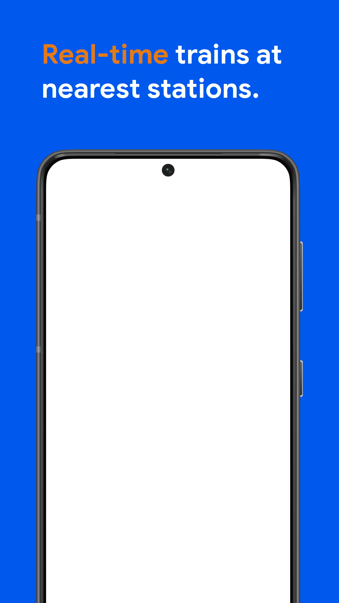

# Framer
Framer will composite a screenshot onto a device frame, by intelligently finding the space for the screenshot.

Built in Rust. 

[](https://github.com/amandeepg/framer/actions/workflows/rust.yml)

### Usage
```
Usage: framer [OPTIONS] <DEVICE_FRAME_PATH> <SCREENSHOT_PATH>

Arguments:
  <DEVICE_FRAME_PATH>  Path to device frame image
  <SCREENSHOT_PATH>    Path to screenshot image

Options:
  -o <OUTPUT_PATH>                  Path to composited output image [default: ./result.png]
  -t, --top-search-axis <percent>   How far, as a percentage, from the left edge to search for the top edge upwards and bottom edge downwards. For example if there is a notch, the default of 25 may hit the notch rather than the top of the frame [default: 25]
  -l, --left-search-axis <percent>  How far, as a percentage, from the top edge to search for the left edge leftwards and the right edge rightwards [default: 50]
      --oxipng-level <level>        The level of optimization to use with oxipng (0-6), lower is faster [default: 4]
      --pngquant-speed <speed>      The level of optimization to use with pngquant (1-10), higher is faster [default: 4]
  -h, --help                        Print help
  -V, --version                     Print version

```

Then you can create your frame with marketing text around it once, and run `framer` in a script to automatically put in updated screenshots.

### Examples
Our first example is an Android device with some marketing text already created. We can then run `framer` to put in a screenshot, which produces the composited image:
# <a href="https://raw.githubusercontent.com/amandeepg/framer/master/docs/frame1.webp"></a> &nbsp;**+**&nbsp; <a href="https://raw.githubusercontent.com/amandeepg/framer/master/docs/screenshot1.webp"></a> &nbsp;&nbsp;&nbsp;**=**&nbsp;&nbsp;&nbsp; <a href="https://raw.githubusercontent.com/amandeepg/framer/master/docs/framescr1.webp"></a>

Of course `framer` is agnostic to the actual device, so an iPhone frame and an iPhone screenshot will work just as well:
# <a href="https://raw.githubusercontent.com/amandeepg/framer/master/docs/frame2.webp"></a> &nbsp;**+**&nbsp; <a href="https://raw.githubusercontent.com/amandeepg/framer/master/docs/screenshot2.webp"></a> &nbsp;&nbsp;&nbsp;**=**&nbsp;&nbsp;&nbsp; <a href="https://raw.githubusercontent.com/amandeepg/framer/master/docs/framescr2.webp"></a>

We can even go further and use `framer` to composite web screenshots onto a laptop frame:
# <a href="https://raw.githubusercontent.com/amandeepg/framer/master/docs/frame3.webp"></a> &nbsp;**+**&nbsp; <a href="https://raw.githubusercontent.com/amandeepg/framer/master/docs/screenshot3.webp"></a> &nbsp;&nbsp;&nbsp;**=**&nbsp;&nbsp;&nbsp; <a href="https://raw.githubusercontent.com/amandeepg/framer/master/docs/framescr3.webp"></a>
